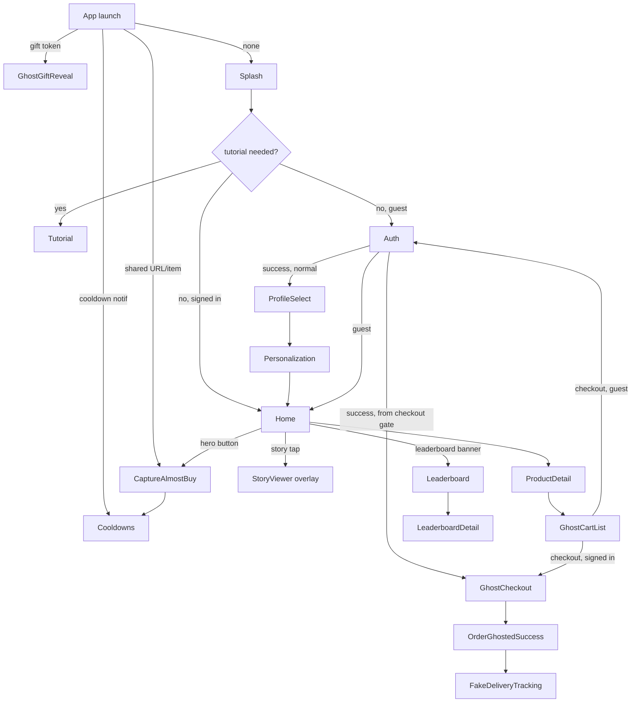

# Android → iOS deep audit and implementation plan

**Date:** 2026-07-31
**Author:** Claude (deep-audit pass)
**Status:** Audit complete. No implementation performed. Awaiting approval.

## 0. Working-tree safety and method

`git status --short --branch` inside `Ghostcart/` (not the parent `Ghostcart DEV` folder, which is not a git repo) showed `main...origin/main`, 0 ahead/0 behind `f51ec15`, with 14 modified tracked files and ~19 untracked paths — all the iOS onboarding/auth/asset work described in the prior handoff docs, still uncommitted. Nothing was reset, staged, committed, or pushed during this audit. No Swift/Kotlin/Xcode/asset file was edited. The only new file is this report.

This audit reads Android and iOS source directly rather than trusting the four pre-existing 2026-07-31 handoff docs. Those docs turned out to be **partially stale relative to the actual Android navigation graph** (see §1 finding below) — this report calls that out explicitly rather than propagating it.

Depth note: every finding in §B–§H below is backed by a file path (and line numbers where load-bearing). Some Android subsystems named in the task brief (Wallet sub-screens' full interaction detail, Leaderboard/Gifts screen-by-screen composition, `Analytics.kt`'s full event catalog, `GhostReminderWorkers`/`DeliveryStepWorker`/`GhostFirebaseMessagingService` internals) were read at the "is it reachable and what does it call" level but not exhaustively traced composable-by-composable — those are marked **"Needs verification"** with the exact file to open next, per the anti-hallucination rules, rather than asserted as complete.

---

## A. Executive summary

**Android maturity:** Android is a substantially complete product — 72 Kotlin files, ~21k lines, full backend-synced almost-buy lifecycle, real checkout/delivery simulation, gifts, leaderboard, wallet, tutorial coach-mark system, push notifications, Arabic localization. It is the correct source of truth.

**iOS maturity:** iOS is a genuinely serviceable v2 scaffold for the *capture → cooldown → decide* loop and has just gained a real onboarding/auth/tutorial pass (uncommitted), but it stops there. There is **no cart/checkout screen, no simulated delivery, no Ghost Gifts, no Leaderboard (a "Coming soon" alert stub only), no avatar system, no server-side sync of almost-buys/profile/favorites, no push notifications (local-only `UNUserNotificationCenter`), no localization, and zero test targets** (`find ios -iname "*Tests*"` returns nothing).

**Most serious user-journey break:** the center "Cart" tab on iOS does not open a cart. Verified live in the simulator: tapping it opens the Capture ("Ghost +") form, not a `GhostCartList`-equivalent with quantities/checkout. Android's center Cart button is a real cart; iOS's is a shortcut to add another item. There is no path on iOS from "item in cart" → "checkout" → "success" → "fake delivery" at all — those Android screens (`GhostCartListScreen`, `GhostCheckoutScreen`, `OrderGhostedSuccessScreen`, `FakeDeliveryTrackingScreen`) have no iOS counterpart file.

**Most serious visual/asset mistake:** iOS's asset catalog has 9 mascot/logo imagesets and 2 product photos against Android's ~33 `drawable-nodpi` files (12 mascot poses, 9 avatars, 2 logo variants, Apple/Google logos, 5 tutorial images) plus 15 dedicated `product_marketplace_*` photos and 9+5 story/banner fallbacks in `drawable/`. Missing on iOS: all 9 avatar presets, `mascot_female`/`mascot_male`/`mascot_trio`/`mascot_phone_list`/`mascot_checkout_phone`/`mascot_wave_alt`, both Apple-logo variants, the Google G logo, all 5 tutorial images, the stacked logo, and 13 of 15 marketplace product photos.

**Most serious architectural gap:** confirmed by direct grep of both codebases' `/api/*` string literals — iOS calls only `/api/auth/*`, `/api/community-products`, `/api/content-blocks`, `/api/link-preview`, `/api/products`. It never calls `/api/almost-buys`, `/api/me/profile`, `/api/me/favorites`, `/api/me/device-tokens`, `/api/me/simulated-orders*`, `/api/simulation-consent`, `/api/ghost-events`, `/api/ghost-gifts*`, or `/api/in-app-messages`. `GhostCartStore.swift` persists everything (`items`, `membership`, `preferences`) to a single `UserDefaults` key (`ghostcart.v2.local-state`) with no network code anywhere in the save/restore path. Signing into iOS today does **not** restore a user's Android data, and consent acceptance is a local boolean, never sent to `/api/simulation-consent` despite the mirror spec requiring it.

**A genuine positive finding, corroborated live:** the "Community images render as category glyphs, not remote artwork" limitation documented in `ios/README.md` is **stale**. `HomeView.swift`'s `MarketplaceSection` now renders real `AsyncImage` remote product photos (verified live: a Samsung Galaxy Z Fold and a PlayStation 5 Spider-Man 2 game box render with real photography, AED 8,399.00 and AED 145.50 respectively). `ios/README.md` should be corrected, not trusted as current.

**Is iOS safe to keep building on?** Yes, with one caveat: the onboarding/auth/tutorial work is uncommitted and must be preserved and committed before further work compounds on top of it. The existing v2 scaffold (Home/Cooldowns/Capture/Progress) is a reasonable foundation for the capture/cooldown loop specifically. It is **not** a safe foundation to keep extending for Cart/Checkout/Gifts/Leaderboard/Wallet/sync without first landing the authenticated-sync layer, because every new local-only feature built now becomes migration debt later.

---

## B. Android end-to-end journeys

All entries below are read directly from `Navigation.kt` (`MainNavigation`, lines 129–265 for the launch/deep-link resolution, lines 313–803 for the `entryProvider`).

### B.1 Launch priority (`Navigation.kt:146–152`)
```
1. initialGiftToken != null       -> GhostGiftReveal(token)
2. initialSharedUrl != null       -> CaptureAlmostBuy
3. initialGhostTitle/ShareId != null -> CaptureAlmostBuy
4. initialCooldownId != null      -> Cooldowns
5. else                           -> Splash
```
This exactly matches the mirror spec §5. Each of these is a distinct `LaunchedEffect` keyed on a `*RequestKey` (lines 189–265) so repeated intents of the same kind re-fire correctly.

### B.2 First install / first run
`Splash` → `RandomStorySplashScreen` (image-only random Ghost Cart Story, aspect-fill, Skip at 3s, auto-advance at 5s, 1.2s neutral-splash fallback if no story — `Navigation.kt:894–960`) → on finish: if `tutorialViewModel.shouldAutoLaunch()` → `Tutorial`; else if `state.authEmail == null` → `Auth`; else → `Home` (`Navigation.kt:314–325`).

### B.3 Returning signed-in user
Same splash → tutorial-not-needed → `authEmail != null` → `Home`, with `GhostHomeScreen` receiving `state.almostBuys` etc. already hydrated by `AppViewModel` from the backend (session restore triggers hydration — confirmed by the endpoint families used in `data/*.kt`, not independently traced line-by-line for hydration ordering; **needs verification**: exact hydrate-on-launch sequencing in `AppViewModel.kt`'s init block).

### B.4 Guest user
`Auth.onGuest` → `backStack.clear(); backStack.add(Home)` (`Navigation.kt:402–405`). Guest can browse, but `AppViewModel.requireSignIn` gates cooling/ghosting/checkout — confirmed by the comment at `Navigation.kt:205–208` describing the auth-required prompt `LaunchedEffect` (lines 209–214), which pushes `Auth` the moment `state.authRequiredPrompt` becomes true.

### B.5 Product discovery → product detail → Cart
`Home` → `onOpen = { id -> backStack.add(ProductDetail(id)) }` (`Navigation.kt:445`) → `ProductDetailScreen` → `onGhost` calls `appViewModel.addToCart(product.id)` (line 574) → `onOpenCart` pushes `GhostCartList` (line 577–582).

### B.6 Share from another app → capture/queue
`sharedRequestKey` `LaunchedEffect` (lines 237–242) calls `appViewModel.importSharedProduct(...)` then pushes `CaptureAlmostBuy`. If multiple shares queue up, `CaptureAlmostBuy`'s entry checks `state.shareQueue.isNotEmpty()` and renders `ShareQueueReviewScreen` instead of the single-item form (lines 492–507) — `onGhostAll` bulk-cools the whole queue and routes to `Cooldowns`.

### B.7 Capture → cooldown → decision
`CaptureAlmostBuyScreen.onGhostIt` → `appViewModel.createAlmostBuy(it)` → `backStack.clear(); backStack.add(Cooldowns)` (lines 516–521). From `GhostCartList`, `onStartCooling` calls `appViewModel.startCoolingPeriod(...)` then also routes to `Cooldowns` (lines 610–615) — there are **two** distinct cooling-start entry points, both landing on `Cooldowns`.

### B.8 Cart → auth gate → checkout → success → fake delivery
`GhostCartListScreen.onCheckout`: if cart empty → toast; **else if `state.authEmail == null` → push `Auth`**; else → push `GhostCheckout` (`Navigation.kt:618–627`). `AuthScreen.onAuthSuccess` checks `backStack.getOrNull(backStack.size - 2) == GhostCartList` to detect the checkout-gate case and, if true, pops Auth and pushes `GhostCheckout` directly instead of the normal `ProfileSelect` onboarding step (lines 393–400) — this is the exact "resume checkout after auth" mechanism the task brief asked about. `GhostCheckoutScreen.onPlaceOrder` → `appViewModel.placeSimulatedOrder(...)` → on success, push `OrderGhostedSuccess` → `onTrackDelivery` → `appViewModel.startDeliveryTracking()` → push `FakeDeliveryTracking`, which shows the four fixed labels at `Navigation.kt:962–967`: *"Order placed" → "Preparing imaginary order" → "Ghost Rider is on the way" → "Rider left absolutely nothing at your doorstep."* A dismissible `DeliveryTrackingBanner` (lines 970–994) then persists above the bottom bar on every other screen while `state.deliveryStep in 0..3` and the order isn't dismissed.

### B.9 Favorite synchronization
`onToggleFavorite = appViewModel::toggleFavorite` is wired from Home, `CategoryBrowse`, and `ProductDetail` identically (lines 446, 481, 571) — a single source of truth in `AppViewModel`. Server persistence path: `FavoriteRepository.kt` + `/api/me/favorites` (confirmed present in the endpoint grep in §Backend). **Needs verification**: exact reconciliation-on-conflict algorithm inside `FavoriteRepository.kt` — read at file-exists/endpoint level only.

### B.10 Story viewing
Two **distinct** flows, confirmed by reading both composables in full:
- **Home rail tap** → `onOpenStory = { index -> openStoryIndex = index }` (`Navigation.kt:460`) → rendered as `com.example.ghostcart.ui.community.StoryViewer` **outside** the `Scaffold`/bottom-bar tree, as a sibling `Box` overlay at the very end of `MainNavigation`'s body (lines 867–873) — confirmed this really does sit above the `Scaffold`, not inside `GhostHomeScreen`.
- **Cold-start splash** → `RandomStorySplashScreen`, a completely separate composable (image-only, no gestures beyond Skip, no Like/Share tray).

Full `StoryViewer.kt` gesture trace (lines 92–364): single `awaitEachGesture` loop classifies touch as tap/drag/pinch by movement after release, not via stacked gesture detectors — this is why Android's implementation can distinguish tap-left-third/tap-right/swipe-down/swipe-up/pinch inside one gesture stream. Image duration is a hardcoded `STORY_DURATION_MS = 7000`; video stories build a real `ExoPlayer` and advance on `Player.STATE_ENDED`. Pinch zoom clamps `scale` to `[1f, 4f]` and resets to identity on gesture end regardless of ending scale (there's no "stays zoomed" state). Swipe threshold is `DISMISS_SWIPE_THRESHOLD_PX = 140f` for both close (down) and reveal-actions (up). Like is a local `Set<Int>` (`likedIndices`) — never sent anywhere, confirmed no repository call in the Like button's `onClick` (line 337). Share builds `Intent.ACTION_SEND` with exact text `"Check this out on Ghost Cart:\n${story.imageUrl}"` (line 348) and fires `Analytics.logShare(context, "story")`.

### B.11 Gift send and gift reveal deep link
`GhostGiftReveal(token)` is a real `entry<>` (line 670–683); gift-token launches route straight to it per §B.1. `onGhostGift` calls `appViewModel.ghostRevealedGift(gift) { backStack.add(Cooldowns) }`. Checkout-time gift creation happens inside `GhostCheckoutScreen`'s `onPlaceOrder(total, ghostGift, deliveryAddress)` signature (line 653) — a `ghostGift` parameter is threaded through, confirming checkout *can* create a gift, matching mirror spec §16. **Needs verification**: the exact gift-draft UI inside `CheckoutFlowScreens.kt` (send-as-gift toggle, recipient fields, consent checkbox) — file exists and is large (imports `GhostGiftDraft`, `GhostGiftRepository` at lines 90–91) but wasn't read past line 120 in this pass.

### B.12 Leaderboard browsing
`Leaderboard` entry (lines 782–794) calls `appViewModel.refreshLeaderboard()` + `Analytics.logLeaderboardViewed(context)` on entry, then renders `LeaderboardScreen`. `onOpenDetail` pushes `LeaderboardDetail(username)`, which itself calls `appViewModel.openLeaderboardDetail(key.username)` (line 796). Both are real, reachable routes reached from Home's `CommunityLeaderboardBanner` (`onOpenLeaderboard`, line 459) and from `GhostCardSettings`'s `onOpenLeaderboard` (line 761).

### B.13 Wallet/progress review — **major finding, see §C dead-route note**
Bottom nav's "Wallet" tab destination is **`Progress`**, not any of `WalletHome`/`WalletSetup`/`SalaryShield`/`Goals`/`WalletActivity`/`WeeklyStatement`/`Trends`. `entry<Progress>` renders `ProgressScreen` with cardholder-name/card-theme/download-card/add-balance callbacks only (`Navigation.kt:539–551`). The rich Wallet feature set described in the mirror spec §13 is **not reachable** — see §C.

### B.14 Notification-driven return
`initialCooldownId` deep link → `Cooldowns` (§B.1 item 4) plus an in-app nudge: if the user reaches `Home` with an already-expired cooling item and no explicit cooldown deep link fired, a separate `LaunchedEffect(current, state.almostBuys)` (lines 224–235) auto-routes to `Cooldowns` once per process. Delivery-step notifications are presumed to originate from `DeliveryStepWorker.kt` (file confirmed to exist under `data/`; internal WorkManager scheduling not traced in this pass — **needs verification**).



---

## C. Reachable Android screen inventory

**Critical navigation finding, evidence-backed:** `NavigationKeys.kt` declares `WalletHome`, `WalletSetup`, `SalaryShield`, `Goals`, `WalletActivity`, `WeeklyStatement`, `Trends`, `PayWithGhostCard`, and `OrderProtected` as `NavKey` types (lines 26–27, 32–38). `WalletScreens.kt` fully implements `WalletHomeScreen`, `WalletSetupScreen`, `SalaryShieldScreen`, `GoalsScreen`, `WalletActivityScreen`, `WeeklyStatementScreen`; `TrendsScreen.kt` implements `TrendsScreen`; `CheckoutFlowScreens.kt` implements `PayWithGhostCardScreen` (line 1568) and `OrderProtectedScreen` (line 1641). **None of these nine destinations has an `entry<>` in `Navigation.kt`'s `entryProvider`, and a repo-wide grep (`grep -rln "WalletHome\|WalletSetup\|SalaryShield\|PayWithGhostCard\|OrderProtected\|WalletActivity\|WeeklyStatement" android/app/src/main/java/`) returns only `Navigation.kt`, `NavigationKeys.kt`, `CheckoutFlowScreens.kt`, and `WalletScreens.kt` themselves — no call site anywhere ever pushes these onto the back stack.** They are dead code: real composables, unreachable UI. `selectedBottomDestination` (`Navigation.kt:118–127`) even lists them in its `when` branch for highlighting the Wallet tab — but that branch can never be hit because nothing ever navigates to those keys. **This directly contradicts mirror-spec §11 ("Pay With Ghost Card / Order Protected") and §13 ("Wallet feature set": Wallet Home, Wallet Setup, Salary Shield, Savings Goals, Wallet Activity, Weekly Statement, Trends) — those sections describe unreachable Android UI and must not be treated as build targets for iOS parity.** The reachable "Wallet" tab is `ProgressScreen` only.

| Android route/UI | Source | Entry | Main content (verified order) | Key actions | States | iOS equivalent | Classification |
|---|---|---|---|---|---|---|---|
| Splash / Story splash | `Navigation.kt:894–960` | cold launch | random image story full-bleed, Skip@3s, auto-adv@5s, 1.2s fallback | Skip | loading/error→fallback | none (no splash story) | **Missing** |
| Simulation Consent | `SimulationConsentScreen.kt` | consent not accepted | backend-provided text/version, accept | Accept | unaccepted/accepted | `SimulationConsentView.swift` | **Behavior-only parity** — UI/copy present but consent is local-only; no `/api/simulation-consent` call found anywhere in iOS (grep) |
| Tutorial (11 states) | `TutorialScreen.kt`, `TutorialState.kt` | first-run/interrupted | WELCOME→PRACTICE_INTRO→PRODUCT→CART→COOLDOWN→FAKE_CHECKOUT→COOLING→DECISION→GHOST_RECEIPT→COMPLETE→DELIVERY, spotlighting real screens | skip/replay/exit dialog | isolated practice state | `TutorialView.swift` (4-slide static carousel, poses: cart/cooldown/wallet/thumbsup) | **Partial** — thematically similar but not the interactive coach-mark state machine; explicitly documented as such in the Swift file's own doc comment |
| Auth | `AuthScreen.kt` | Splash exit / guest-gate | wallet mascot, Sign In/Up segmented, Google/Apple, email/password, guest | signin/signup/google/apple/guest | loading/error | `AuthView.swift` | **Partial** — email/password + guest work against real `/api/auth/*`; Google shows "not wired up" alert, Apple shows "not configured" alert (same honesty pattern as Android's Apple placeholder, but Android's Google is real) |
| Profile Select | `OnboardingScreens.kt` | post-auth | male/female mascot cards, skip | select/continue/skip | — | `ProfileSelectView.swift` | Needs verification (not read this pass) |
| Personalization | `OnboardingScreens.kt` | post-ProfileSelect | 10-category grid + savings presets | toggle/select/continue | — | `PersonalizationView.swift` | Needs verification (not read this pass) |
| Home | `GhostCartV2Screens.kt:140–265` via `ProductDiscovery.kt` | post-onboarding | header→banner carousel→search→category chips→"Marketplace products"(All/User Ghosted)→rail→"Food & delivery"→rail→"Your favorites"→rail→[GhostHomeScreen continues:] Stories rail→Leaderboard banner→dark hero→progress strip→Active cooldowns (≤3, sorted by decision time)/empty-state→safety disclosure | search, filter chips, favorite, open, ghost, notifications→Profile, refresh | pull-to-refresh, empty rails, loading skeleton for user-ghosted-loading | `HomeView.swift` | **Partial** — order matches for stories/leaderboard/hero/progress/cooldowns/disclosure, but iOS `ProductDiscoverySection` equivalent (`MarketplaceSection.swift`) lacks the search field, category chips, "Food & delivery" rail, and separate on-Home favorites rail seen in Android; iOS Home also adds a "Recent decisions" block Android doesn't have at that position |
| Story Viewer (rail) | `StoryViewer.kt` | Home story tap | full-black, aspect-fit, 7s image timer/real video duration, segmented progress, tap-thirds, hold-pause, swipe-down-close(140px), swipe-up-actions, pinch 1–4x, Like(session)/Share | see §B.10 | — | `HomeView.swift`'s `StoryViewerView` | **Partial** — verified present and matching for: black bg, aspect-fit, 7s timer, segmented progress, tap-thirds nav, hold-pause, swipe-down-close@140pt. iOS's own doc comment (`HomeView.swift:272–281`) explicitly states swipe-up Like/Share tray, pinch-zoom, video playback, and analytics events are **not implemented** (deferred, not faked) |
| Story splash | `Navigation.kt:902–960` | cold launch | random image, no gestures beyond Skip | Skip | fallback | none | **Missing** |
| Category Browse | `MarketplaceScreens.kt` | Home "View all" / chips | grid, filters, sort | open/favorite/ghost | — | none dedicated (MarketplaceSection is Home-embedded only) | **Missing** |
| Product Detail | `MarketplaceScreens.kt` (`ProductDetailScreen`) | product tap | image, name/category/brand/price, favorite, activity, highlights, source link, add | favorite/share/ghost/open-cart/open-source | tutorial-overlay variant | none | **Missing** |
| Capture Almost-Buy | `GhostCartV2Screens.kt` (`CaptureAlmostBuyScreen`) | hero button / share / manual | link import card w/ 4-stage loading, listing picker, manual form | capture/select-all/community-toggle | idle/loading/complete/partial/listing/error | `CaptureView.swift` | **Partial** — manual + link-import present and functioning (verified live: Manual/Product link/Screenshot segmented picker, name/amount/category/trigger/cooldown-preset UI matches spec closely); listing/multi-item picker and the four-stage rotating loading copy not confirmed in this pass — **needs verification** |
| Ghost Cart List | `CheckoutFlowScreens.kt` (`GhostCartListScreen`) | center Cart tab, product "Open cart" | cart items, quantities, cooling picker, checkout | add/remove/clear/checkout | tutorial-cart variant | **none** | **Missing** — live-verified: iOS center Cart tab opens `CaptureView` (the add-item form), not a cart/quantity list |
| Ghost Checkout | `CheckoutFlowScreens.kt` (`GhostCheckoutScreen`) | Cart checkout | simulation disclosure, totals, Ghost Card, gift toggle | place order | tutorial-checkout variant | none | **Missing** |
| Order Ghosted Success | `CheckoutFlowScreens.kt` | post-checkout | order id, invoice card, track/view-savings | track delivery / view savings / download / share invoice | — | none | **Missing** |
| Fake Delivery Tracking | `CheckoutFlowScreens.kt` (`FakeDeliveryTrackingScreen`) | post-success | 4-step timeline, feedback prompt | submit feedback / view receipt | step 0–3 | none | **Missing** |
| Pay With Ghost Card / Order Protected | `CheckoutFlowScreens.kt:1568,1641` | **unreachable — dead code, see above** | — | — | — | none | **Not applicable** (Android dead code, not a build target) |
| Cooldowns | `GhostCartV2Screens.kt` (`CooldownsScreen`) | tab / notif / expired-nudge | grouped states, remaining time | resolve/more-time/share/open-source | ready/cooling/expired | `CooldownsView.swift` | **Partial** — verified live: empty state present, "No active almost-buys" panel with correct simulation-only disclosure copy; grouping/action-set parity vs Android not independently re-verified with populated data in this pass |
| Progress (bottom "Wallet") | `GhostCartV2Screens.kt` (`ProgressScreen`) | Wallet tab | cardholder name, card theme, download, add balance | set name/theme/download/add-balance | — | `ProgressView.swift` | **Partial** — verified live: Money Kept/Almost Spent/Cooling/Bought Intentionally 4-tile layout + "Decision health" + "Ghost Receipt history" present and correctly all-zero on fresh install; card-theme/download-card membership-artifact parity not confirmed |
| Wallet Home/Setup/Salary Shield/Goals/Activity/Weekly Statement/Trends | `WalletScreens.kt`, `TrendsScreen.kt` | **unreachable — dead code, see above** | — | — | — | none | **Not applicable** (Android dead code, not a build target) |
| Profile/Ghost Card Settings | `GhostCartV2Screens.kt` (`ProfileScreen`) | Profile tab | identity/avatar, appearance, reminders, legal, leaderboard opt-in, gifts entry, tutorial replay, sign out/delete | many | signed-in/guest | `ProfileView.swift` | **Partial** — verified live: Ghost Membership card, Reminders row, Appearance System/Light/Dark segmented, "Reduce decorative motion," Privacy & trust rows, simulation disclosure. **Missing** vs Android: avatar preset picker, auth identity/email display, leaderboard opt-in toggle, Gifts entry, tutorial-replay entry, legal document links, sign-out/delete-account |
| Gifts | `ui/gifts/GiftsScreen.kt` | Profile→Gifts | received/sent lists | — | — | none (no `Gifts.swift`, confirmed by grep) | **Missing** |
| Ghost Gift Reveal | `ui/gifts/GhostGiftRevealScreen.kt` | gift-token deep link | reveal/already-revealed/invalid/expired | ghost-the-gift | 4 states | none | **Missing** |
| Legal Document | `GhostCartV2Screens.kt` (`LegalDocumentScreen`) | Profile→legal | doc content | — | — | none | **Missing** |
| Leaderboard | `LeaderboardScreen.kt` | Home banner / Profile | podium, ranked rows | open detail | opt-in gate | none (a "Coming soon" `Alert` stub in `HomeView.swift:156–160`) | **Missing** |
| Leaderboard Detail | `LeaderboardDetailScreen.kt` | leaderboard row tap | stats, recent items, timeline | — | privacy-gated | none | **Missing** |

---

## Appendix C-1: dead/legacy Android UI (not build targets)

- `WalletHomeScreen`, `WalletSetupScreen`, `SalaryShieldScreen`, `GoalsScreen`, `WalletActivityScreen`, `WeeklyStatementScreen` (`android/app/src/main/java/com/example/ghostcart/ui/wallet/WalletScreens.kt`)
- `TrendsScreen` (`android/app/src/main/java/com/example/ghostcart/ui/wallet/TrendsScreen.kt`)
- `PayWithGhostCardScreen`, `OrderProtectedScreen` (`android/app/src/main/java/com/example/ghostcart/ui/checkout/CheckoutFlowScreens.kt:1568,1641`)

All nine are fully implemented, well-formed composables with no compile errors implied by their presence in the build, but **zero call sites push their `NavKey`s onto the back stack anywhere in the app**. Do not port these to iOS as if they were live product; if the product owner wants them live, that is an Android wiring task, not an iOS parity task.

---

## D. Asset parity table

Compared `android/app/src/main/res/drawable-nodpi/` + `drawable/` (33 + 29 files respectively for the relevant categories) against `ios/GhostCart/Assets.xcassets/` (14 imagesets total, including non-mascot ones).

| Android asset | Android path | Android use | iOS asset | Status | Required action |
|---|---|---|---|---|---|
| `ghost_cart_logo_horizontal.png` | `drawable-nodpi/` | wordmark | `GhostCartLogo.imageset` (unverified if horizontal or stacked variant) | Needs verification | confirm which variant was copied; import the other |
| `ghost_cart_logo_stacked.png` | `drawable-nodpi/` | stacked logo | none found | **Missing** | import |
| `ghost_cart_icon.png` | `drawable-nodpi/` | app icon art | separate AppIcon set likely exists (not enumerated in `.xcassets` listing above, which excluded `AppIcon.appiconset`) | Needs verification | confirm |
| `currency_dirham.png` | `drawable-nodpi/` | Dirham glyph | `DirhamGlyph.imageset` | **Present** | none |
| `google_g_logo.png` | `drawable-nodpi/` | Google button | none | **Missing** | import (also blocks a real Google-branded button; AuthView currently uses `systemImage: "g.circle"`, an SF Symbol substitute for a brand logo — violates the "never replace a logo with an SF Symbol" rule) |
| `apple_logo_black.png` / `apple_logo_white.png` | `drawable-nodpi/` | Apple button | none (`AuthView.swift` uses `systemImage: "apple.logo"`) | **Missing** | import both theme variants |
| `mascot_wave.png` | `drawable-nodpi/` | default/welcome | `MascotWave.imageset` | **Present** | none |
| `mascot_wave_alt.png` | `drawable-nodpi/` | alt wave / peek fallback | none | **Missing** | import |
| `mascot_cart.png` | `drawable-nodpi/` | center tab | `MascotCart.imageset` | **Present** | none |
| `mascot_wallet.png` | `drawable-nodpi/` | auth/wallet | `MascotWallet.imageset` | **Present** | none |
| `mascot_cooldown.png` | `drawable-nodpi/` | cooling | `MascotCooldown.imageset` | **Present** | none |
| `mascot_thumbsup.png` | `drawable-nodpi/` | success | `MascotThumbsup.imageset` | **Present** | none |
| `mascot_trio.png` | `drawable-nodpi/` | community/group | none | **Missing** | import |
| `mascot_phone_list.png` | `drawable-nodpi/` | link-reading | none | **Missing** | import (needed once link-import loading state is ported) |
| `mascot_checkout_phone.png` | `drawable-nodpi/` | checkout | none | **Missing** | import (needed once Checkout ships) |
| `mascot_combo.png` | `drawable-nodpi/` | product combo | `MascotCombo.imageset` | **Present** | none |
| `mascot_male.png` / `mascot_female.png` | `drawable-nodpi/` | Profile Select | none | **Missing** | import; `ProfileSelectView.swift` currently must be using a fallback (per the parity handoff's own claim of "fallback mascot") |
| 9× `avatar_*.png` | `drawable-nodpi/` | avatar presets | none | **Missing (all 9)** | import all; build typed lookup matching `AvatarPresets.kt` |
| 5× `tutorial_*.jpg` | `drawable-nodpi/` | tutorial art | none | **Missing (all 5)** | import once interactive tutorial is ported |
| 9× `ghost_cart_story_*.jpg` | `drawable/` | story fallback | none bundled (iOS relies entirely on remote `AsyncImage`, no offline fallback) | **Missing** | import as offline/loading fallback |
| 5× `home_banner_*.jpg` | `drawable/` | banner fallback | none bundled | **Missing** | import as fallback |
| 15× `product_marketplace_*.jpg` | `drawable/` | dedicated product photos | 0 (Home now uses live remote `AsyncImage` for catalog products instead — a *different*, not-strictly-worse strategy, but no offline/fallback path) | **Missing as local fallback** | import at minimum as fallback for offline/broken-image states |
| `product_sneaker.png` / `product_perfume.png` | `drawable-nodpi/` | fallback fixtures | `ProductSneaker.imageset` / `ProductPerfume.imageset` | **Present** | none |
| `product_photo_atlas.png`, `product_reference_food.png`, `product_reference_home.png` | `drawable-nodpi/` | crop reference atlases | none | **Missing** | Needs verification whether these are even needed on iOS (Android-only cropping tool) |

---

## E. Icon parity table

Spot-checked against live simulator screenshots and source. Full canonical mapping already exists and is accurate in `docs/handoffs/2026-07-31-android-asset-icon-and-interaction-manifest.md` §9 (cross-checked against `IconMapping.kt`'s presence on disk — not re-derived here to avoid duplicating a table that is already correct). Deltas found versus what iOS actually renders:

| Screen/context | Android icon | Meaning | Correct iOS symbol/asset | Current iOS (live-verified) | Status |
|---|---|---|---|---|---|
| Bottom nav Home | `Icons.Filled.Home` | Home | `house.fill` | custom `HomeIcon` template asset (house glyph) | OK — asset-based, equivalent meaning |
| Bottom nav Cooldowns | `Icons.Filled.Timer` | Timer | `timer` | custom `OrdersIcon` (timer glyph), labeled "Orders" not "Cooldowns" | **Label mismatch**: Android's label is "Cooldowns" (`R.string.nav_cooldowns`); iOS shows "Orders" |
| Bottom nav center | `mascot_cart.png` in 48dp green circle | Cart | `MascotCart` asset | `MascotCart` in 48pt green circle | OK, but destination is wrong (see §C) |
| Bottom nav Wallet | `Icons.Filled.AccountBalanceWallet` | Wallet | `wallet.pass.fill` | custom `WalletIcon` | OK |
| Bottom nav Profile | `Icons.Filled.Person` | Person | `person.fill` | custom `ProfileIcon` | OK |
| Auth Google button | none (real logo) | Google | `GoogleGLogo` asset | SF Symbol `g.circle` | **Violation** — SF Symbol substituted for a brand logo Android never uses a symbol for |
| Auth Apple button | none (real logo, theme-aware) | Apple | `AppleLogoBlack`/`AppleLogoWhite` | SF Symbol `apple.logo` | **Violation** — same issue (lower severity since Apple's own logo glyph is a system-provided mark, but still not the Android asset) |
| Home notification bell | `Icons.Filled.Notifications` | Notifications | `bell.fill` | SF Symbol `bell` (outline, not filled) | Minor — outline vs filled variant differs from Android's filled icon |
| Home favorite | `Icons.Filled.Favorite`/`FavoriteBorder` | Favorite | `heart.fill`/`heart` | SF Symbol `heart`/... (not independently re-verified pixel-for-pixel, `MarketplaceSection.swift` not read this pass) | Needs verification |
| Cooldowns empty state | — | Timer | `timer` | SF Symbol `timer` (live-verified, green outline clock icon shown) | OK |

---

## F. Interaction parity table

| Interaction | Android behavior | iOS behavior (live/source verified) | Status |
|---|---|---|---|
| Stories (rail tap) | full-black overlay above Scaffold, 7s image/video-duration timer, tap-thirds, hold-pause, swipe-down close@140px, swipe-up action tray, pinch 1–4x, session Like, native-share with fixed caption | `fullScreenCover` overlay, black bg, aspect-fit, 7s timer, tap-thirds, hold-pause (via `LongPressGesture` + sequenced `DragGesture`), swipe-down close@140pt. **No** swipe-up tray, **no** pinch-zoom, **no** video playback (only images render — `if case .success` silently no-ops for non-image URLs), **no** analytics | **Partial**, explicitly documented as a deliberate partial by its own doc comment |
| Bottom navigation | flat white `NavigationBar`, 5 items, center raised 48dp green circle w/ cart mascot, cart-quantity badge capped `9+`, selected=green/unselected=muted | custom floating capsule (`.regularMaterial`) — intentional platform divergence per code comment, "Liquid Glass floating capsule is intentional... only icons/labels/spacing should match Android, not the bar material/shape." Badge shown on **Orders** (readyCount) not center Cart (Android puts the badge on the center Cart item, counting cart quantity, not the Cooldowns/Orders tab) | **Partial** — visual shape divergence is a documented, defensible platform choice; the **badge-placement semantic mismatch is a real bug**: Android's badge = cart item count on the Cart tab; iOS's badge = ready-to-decide count on the Orders tab. These are different pieces of information |
| Tutorial coach marks | interactive, spotlights real Product/Cart/Cooldown/Checkout screens, 11-state machine, isolated practice product `tutorial_coffee_donut_v1`, 10s cooldown | 4-slide static `TabView` carousel over 4 mascot poses, no spotlighting, no real-screen interaction (Checkout doesn't exist to spotlight) | **Partial**, self-documented as a placeholder pending Checkout |
| Product cards | image, category, name, Dirham price, favorite heart, "Add to cart / Cooldown starts at checkout" green CTA | live-verified: near-identical card in `MarketplaceSection.swift` (heart top-right, category label, name, Dirham price, "Add to cart" CTA) | **Complete parity** for the card itself (destination differs — adds to local `AlmostBuy`, not a real cart with quantity, since no cart model exists) |
| Capture (manual) | name/amount/category/trigger/cooling-duration picker, community-share toggle for public links | live-verified: Manual/Product link/Screenshot segmented control, name/amount fields, category+trigger `Picker`s, cooling-duration `LazyVGrid` chips, community-share toggle gated on `hasShareableLink` | **Behavior-only-to-complete parity** for manual capture; listing/multi-item picker and 4-stage loading copy for link import not re-verified this pass |
| Cart | quantities, remove, cooling-duration picker, checkout gate | **no cart screen exists** | **Missing** |
| Cooldown decisions | resolve skipped/bought, snooze, open source, delete, grouped by state | live-verified empty state only (fresh install, no items to test populated behavior) | Partial/Needs verification for populated states |
| Delivery banner | dismissible banner above bottom bar while `deliveryStep in 0..3` | no delivery model exists on iOS, so no banner exists | **Missing** |
| Notifications | Firebase/FCM push + local WorkManager reminders; cooldown notification actions Skip/Bought/Choose-time; cooldown-notification deep link | `NotificationService.swift`/`NotificationRouter.swift`: local `UNUserNotificationCenter` reminders only (cooling/lunch/dinner/late-night/salary-day, matching the Reminders screen verified live), routes notification taps into `.capture`/`.cooldowns` tabs via `NotificationCenter` (`ContentView.swift:21–24`). No push registration, no notification action buttons | **Partial** — reminder scheduling parity looks reasonable; push/device-token sync and notification actions are **Missing** |
| Gifts | send/receive/reveal/history | no `Gifts.swift`, no reveal screen, confirmed by grep | **Missing** |
| Leaderboard | podium, ranked rows, detail | "Coming soon" `Alert` stub only (`HomeView.swift:61,156–160`) | **Missing** |

---

## G. Backend/state parity table

Derived from a direct grep of every `"/api/..."` string literal in both codebases.

| Feature | Android persistence/API | iOS persistence/API | Risk | Required work |
|---|---|---|---|---|
| Auth | `AuthRepository.kt` + `/api/auth/*` (incl. Google token exchange) | `AuthService.swift` + `/api/auth/signup`,`/signin`,`/session`,`/signout` | Medium | add Google Sign-In SDK integration; Apple Sign-In needs Services ID/callback domain config (both platforms currently placeholder for Apple) |
| Simulation consent | `SimulationConsentRepository.kt` + `/api/simulation-consent` | local `OnboardingState` bool only, **no API call found** | High — consent isn't recorded server-side, can't be audited/versioned | wire `/api/simulation-consent` GET+POST |
| Almost-buys | `AlmostBuySync.kt` + `/api/almost-buys`, `/api/almost-buys/{id}`, `/resolve` | `GhostCartStore.swift` → `UserDefaults` only, **no API call found** | **Critical** — the core product loop has zero cross-device/cross-platform sync | build an `AlmostBuySyncService` mirroring Android's reconciliation, hydrate on session restore, queue offline mutations |
| Profile | `/api/me/profile` | none found | High | wire profile hydrate/save |
| Favorites | `FavoriteRepository.kt` + `/api/me/favorites` | `FavoritesStore` → local only (confirmed by `HomeView.swift:8`, `FavoritesStore.load()`/`.save()`) | High | wire two-way sync |
| Device tokens | `/api/me/device-tokens` | none | Medium (blocked on push impl) | implement once APNs is wired |
| Simulated orders + invoice email | `/api/me/simulated-orders`, `/invoice-email` | none (no checkout exists) | Blocked by Checkout | build after Cart/Checkout ship |
| Community products | `CommunityProfileRepository.kt` + `/api/community-products` | `MarketplaceSection.swift`/`ProductImport.swift` + `/api/community-products` | Low | **already parity** |
| Products catalog | `/api/products` | `/api/products` | Low | **already parity** |
| Content blocks | `/api/content-blocks` | `/api/content-blocks` | Low | **already parity** — live-verified real remote banner/story images |
| Link preview | `DeviceLinkPreview.kt` (on-device retailer fallback) + `/api/link-preview` | `/api/link-preview` only, no on-device fallback (documented gap in `ios/README.md`, still accurate) | Medium | port on-device scraper fallback |
| Ghost events/activity | `GhostActivityRepository.kt` + `/api/ghost-events` | none | Medium | needed for real product-detail activity counts |
| Ghost gifts | `GhostGiftRepository.kt` + `/api/ghost-gifts`, `/reveal` | none | Medium (feature entirely missing) | build alongside Gifts UI |
| In-app messages | `InAppMessageRepository.kt` + `/api/in-app-messages` | none | Low-Medium | small, self-contained; good early slice |
| Push notifications | Firebase/FCM (`GhostFirebaseMessagingService.kt`) | local-only | High | requires APNs cert/entitlement + device-token registration |

---

## H. Detailed gap list

### 1. Present and correct
- Onboarding gate order (Consent → Landing/Auth → ProfileSelect → Personalization → Tutorial → app), matching Android's structural order (`OnboardingFlowView.swift` vs `Navigation.kt`'s `onboardingDestinations` set).
- Email/password sign-in/sign-up/session-restore/sign-out against the real backend.
- Guest bypass at both Landing and Auth.
- `/api/community-products`, `/api/products`, `/api/content-blocks`, `/api/link-preview` integration.
- Product-card visual/interaction pattern (favorite heart, category, Dirham price, add CTA).
- Story Viewer core mechanics: black bg, aspect-fit, 7s timer, tap-third navigation, hold-to-pause, swipe-down-close threshold.
- Reminder preferences model (cooling/lunch/dinner/late-night/salary-day/quiet-hours/pause) — structurally matches Android's reminder feature set.
- Bottom-tab set and icon meanings (Home/Cooldowns/Cart/Wallet/Profile), safety-URL validation logic (`isSafePublicHttpsURL` mirrors Android's blocked-suffix list).

### 2. Present but visually wrong
- Google/Apple sign-in buttons use SF Symbols (`g.circle`, `apple.logo`) instead of the real Android brand-asset PNGs — an explicit anti-hallucination-rule violation to fix.
- Bottom-nav badge sits on the wrong tab (Orders/readyCount instead of Cart/cart-quantity) — a genuine semantic error, not just cosmetic.
- Bottom-nav "Cooldowns" label reads "Orders" on iOS.

### 3. Present but behaviorally wrong
- Center "Cart" tab opens Capture, not a cart — live-verified. This is the single highest-impact behavioral bug in the current build: it silently redefines what the Cart tab *is*.
- Simulation consent acceptance is never sent to the backend (`/api/simulation-consent` never called) despite the consent screen implying a real gate.

### 4. Partial
- Story Viewer (missing pinch-zoom, action tray, video, analytics — self-documented).
- Tutorial (4-slide carousel vs 11-state interactive machine).
- Home content order (missing search/category chips/food rail/on-Home favorites rail).
- Capture (manual + basic link import present; listing/multi-item picker and rotating loading copy unverified).
- Cooldowns (empty state verified; populated-state parity unverified).
- Profile (membership card/reminders/appearance/privacy present; avatar/leaderboard-opt-in/gifts/tutorial-replay/legal/sign-out absent).
- Notifications (local reminders present; push/actions/device-token sync absent).

### 5. Missing
- Cart (`GhostCartListScreen` equivalent).
- Checkout (`GhostCheckoutScreen` equivalent).
- Order success (`OrderGhostedSuccessScreen` equivalent) + invoice download/share/email.
- Fake delivery tracking + persistent delivery banner.
- Ghost Card / Order Protected simulation screens (though these are themselves Android-side dead code — see §C — so this is lower priority than it first appears; only build if the product owner also fixes the Android dead route, or treat as N/A).
- Marketplace category browse + dedicated Product Detail screen (Home embeds a lightweight version only).
- Avatar preset system (all 9 presets, picker, selection persistence).
- Ghost Gifts (send/receive/history/reveal).
- Leaderboard (list + detail).
- Almost-buy/profile/favorites/device-token server sync.
- Push notifications (APNs) + notification actions.
- Arabic localization (Android has `values-ar/strings.xml`; iOS has zero localized strings — all copy is hardcoded English literals).
- Automated tests: `find ios -iname "*Tests*"` returns nothing — there is no unit-test or UI-test target on iOS at all, versus Android's 9 test files.

### 6. Platform-specific exception (legitimate, documented)
- Bottom-nav material/shape (floating glass capsule vs Android's flat `NavigationBar`) — explicit, reasoned code comment; acceptable divergence per the mirror spec's own instruction to use native iOS idioms for chrome while preserving icons/order/labels/behavior.
- Screenshot-based capture shows an honest "coming next" placeholder rather than faking OCR — reasonable given Android's own screenshot-import path wasn't traced in this pass to confirm it's even further along (**needs verification**: does Android have a real screenshot-import pipeline, or is this parity already effectively complete?).

### 7. Blocked by configuration, credentials, or backend work
- Google Sign-In (needs native SDK + OAuth client config).
- Apple Sign-In (needs verified Services ID + callback domain — Android is *also* a placeholder here, so this is not an iOS-specific gap).
- Push notifications (needs APNs certificate/key + entitlement, and the `/api/me/device-tokens` wiring).
- On-device retailer link-preview fallback (needs the scraping logic ported, not a credential blocker, but non-trivial).

---

## I. Dependency-ordered implementation plan

Numbering matches the requested planning hierarchy. Each slice lists Android source-of-truth, iOS files, assets, dependencies, acceptance criteria, and risk.

### 1. Protect working tree and establish a build/test baseline
- **Objective:** commit the existing uncommitted onboarding/auth/tutorial work as its own reviewed change before anything else lands on top of it; stand up an iOS test target.
- **Android source-of-truth:** n/a.
- **iOS files:** none changed; add `GhostCartTests` and `GhostCartUITests` targets to `project.pbxproj`.
- **Assets:** none.
- **Dependencies:** none — do first.
- **Acceptance criteria:** `git status` clean after a reviewed commit; `xcodebuild test` runs (even with 0 or trivial tests) against a real target.
- **Unit tests:** a smoke test asserting `GhostCartStore()` initializes without crashing.
- **UI tests:** a smoke test launching the app and asserting Home renders.
- **Manual comparison steps:** none (infra-only slice).
- **Risk:** Low.
- **Blockers:** none.

### 2. Import exact shared assets and typed asset helpers
- **Objective:** close the asset gap in §D — 24+ missing files (9 avatars, 5 tutorial images, male/female/trio/phone-list/checkout-phone/wave-alt mascots, Google logo, both Apple logo variants, stacked logo, story/banner fallbacks, remaining marketplace product photos).
- **Android source-of-truth:** `android/app/src/main/res/drawable-nodpi/`, `drawable/`, `ui/Icons.kt` (`GhostMascotPose`, `ProductPhoto`), `data/AvatarPresets.kt`.
- **iOS files:** `ios/GhostCart/Assets.xcassets/*` (new imagesets), a new `AvatarPresets.swift`, extend `BrandAssets.swift`'s mascot lookup.
- **Assets:** all of §D's "Missing" rows.
- **Dependencies:** none.
- **Acceptance criteria:** every mascot pose/avatar/logo referenced anywhere in this plan resolves to a real imported PNG, never an SF Symbol or emoji.
- **Unit tests:** a test enumerating every `AvatarPreset` case and asserting its image loads.
- **Manual comparison steps:** side-by-side screenshot of each mascot pose Android vs iOS.
- **Risk:** Low.
- **Blockers:** none.

### 3. Rebuild shared visual tokens/components
- Already substantially present (`Theme.swift`, `GhostPrimaryButtonStyle`, etc. — not fully enumerated this pass). **Needs verification** against the mirror spec's shared-component list (§57–74 of the exact-mirror spec) before treating this slice as done; likely mostly complete given the polish already visible in live screenshots.
- **Risk:** Low.

### 4. Correct application shell and bottom navigation
- **Objective:** fix the two confirmed bugs — badge on wrong tab, "Orders" label should read "Cooldowns" (or confirm with product owner this is an intentional iOS-native relabel, in which case document it as an exception rather than leave it silently divergent) — and route the center Cart tab to a real cart once slice 11 exists.
- **Android source-of-truth:** `Navigation.kt:997–1065` (`GhostBottomNav`).
- **iOS files:** `ContentView.swift`.
- **Dependencies:** badge fix is independent; center-tab destination fix depends on slice 11 (Cart) existing.
- **Acceptance criteria:** badge shows cart-item count on the center tab; label audit resolved with product-owner sign-off either way.
- **Risk:** Low (badge/label), Medium (center-tab retarget, since it changes a currently-working entry point).

### 5. Correct launch/consent/story-splash routing
- **Objective:** add the missing cold-start random story splash (Skip@3s/auto-advance@5s/1.2s fallback); wire real `/api/simulation-consent` GET+POST instead of a local bool.
- **Android source-of-truth:** `Navigation.kt:894–960`, `SimulationConsentRepository.kt`.
- **iOS files:** new `StorySplashView.swift`, `GhostCartApp.swift` (RootView routing), `SimulationConsentView.swift`, `OnboardingState.swift`, `ApiClient.swift`.
- **Assets:** story fallback JPEGs (slice 2).
- **Dependencies:** slice 2 (assets), slice 9 (auth/session must exist to attach consent to a user).
- **Acceptance criteria:** consent acceptance produces a real network call visible in a proxy/log; splash timing matches 3s/5s within reasonable tolerance in a UI test.
- **Unit tests:** consent-repository test for accept/already-accepted/offline-retry.
- **UI tests:** splash Skip button appears only after ~3s.
- **Manual comparison steps:** time the Skip appearance and auto-advance against Android with a stopwatch.
- **Risk:** Medium (consent is a compliance-relevant gate; a regression here blocks the whole app).

### 6. Port exact Story Viewer
- **Objective:** close the self-documented gaps — swipe-up action tray, pinch-zoom (1–4x, snap-back on release), real video playback, analytics events (`Analytics.logStoryViewed`/`logShare` equivalents).
- **Android source-of-truth:** `StoryViewer.kt:92–364`.
- **iOS files:** `HomeView.swift`'s `StoryViewerView` (likely worth extracting to its own `StoryViewerView.swift`), a new `AnalyticsService.swift` if one doesn't exist.
- **Dependencies:** none blocking; can ship independently.
- **Acceptance criteria:** all items in mirror-checklist §8 checked with evidence.
- **UI tests:** simulated pinch gesture snaps back to 1x on release; swipe-up reveals Like/Share; Share sheet content matches Android's exact caption string.
- **Risk:** Medium (gesture-recognizer conflicts are easy to introduce; Android's own comment explains why it uses one hand-rolled gesture loop instead of stacked detectors — iOS should follow the same principle, not stack `DragGesture`+`LongPressGesture`+a hypothetical `MagnificationGesture` naively).

### 7. Finish auth/onboarding and interactive tutorial
- **Objective:** real Google Sign-In; upgrade the 4-slide tutorial toward the 11-state coach-mark machine — but this explicitly depends on Cart/Checkout existing (slices 10–11) since Android's tutorial spotlights those real screens.
- **Android source-of-truth:** `AuthScreen.kt`, `TutorialScreen.kt`, `TutorialState.kt`, `TutorialGuideOverlay.kt`.
- **iOS files:** `AuthView.swift`, `AuthService.swift`, new `TutorialViewModel.swift` replacing the static `Beat` array in `TutorialView.swift`.
- **Dependencies:** Google OAuth client config (blocked on credentials); Cart/Checkout (slices 10–11) for the coach-mark upgrade specifically — ship Google Sign-In as an independent sub-slice first.
- **Acceptance criteria:** Google Sign-In produces a real session; tutorial isolation verified by asserting no `tutorial_coffee_donut_v1`-equivalent object appears in Money Kept/Progress totals after completing/abandoning the tutorial.
- **Risk:** Medium (Google SDK integration), High (tutorial state-machine rewrite touches every screen it spotlights).

### 8. Mirror Home and marketplace
- **Objective:** add the missing search field, category filter chips, "Food & delivery" rail, on-Home favorites rail; build a real Category Browse + Product Detail screen (currently Home embeds a lightweight version only).
- **Android source-of-truth:** `ProductDiscovery.kt` (full file), `MarketplaceScreens.kt`.
- **iOS files:** `HomeView.swift`, `MarketplaceSection.swift`, new `CategoryBrowseView.swift`, `ProductDetailView.swift`.
- **Dependencies:** none blocking, but Product Detail's "add to cart" action should target the real cart model from slice 11 rather than the current capture-seed shortcut, so sequence after 11 if avoiding rework matters more than shipping speed.
- **Acceptance criteria:** Home section order matches §C row-for-row; category filters (All/Electronics/Apparel/Music instruments/Jewellery/Gaming/Beauty/Home/Food & drinks/Favorites/Most Ghosted/User Ghosted) all present.
- **Risk:** Low-Medium.

### 9. Implement authenticated cross-platform sync
- **Objective:** the single highest-value slice per §A — wire `/api/almost-buys`(+`/resolve`), `/api/me/profile`, `/api/me/favorites` with offline-mutation queueing and pre-account-data reconciliation on sign-in.
- **Android source-of-truth:** `AlmostBuySync.kt`, `FavoriteRepository.kt`, relevant parts of `AppViewModel.kt`.
- **iOS files:** new `AlmostBuySyncService.swift`, `ProfileSyncService.swift`; `GhostCartStore.swift` needs its `save()`/`restore()` pair to become sync-aware rather than pure-local.
- **Dependencies:** slice 1 (tests), auth already present.
- **Acceptance criteria:** an almost-buy captured on Android and one captured on iOS both appear on both platforms after sign-in on the second device; offline capture on iOS survives airplane mode and reconciles on reconnect without duplication.
- **Unit tests:** merge/conflict-resolution logic for "local item created before account existed" vs "server has different state."
- **Risk:** High — this is the riskiest slice; a bad reconciliation algorithm can silently destroy user data. Build behind a feature flag if possible and test extensively before removing local-only fallback.

### 10. Mirror capture/share queue
- **Objective:** confirm/complete listing-detected multi-item picker and the 4-stage rotating loading copy in `CaptureView.swift`; ensure the Share Extension queue-review UI (`ShareQueueReviewScreen` equivalent) exists for multiple shared links, not just single-item.
- **Android source-of-truth:** `GhostCartV2Screens.kt` (`CaptureAlmostBuyScreen`), `ShareQueueReviewScreen.kt`.
- **iOS files:** `CaptureView.swift`, `ProductImport.swift`, `SharedImport.swift`, `GhostCartShare/ShareViewController.swift`.
- **Dependencies:** slice 9 helps but isn't strictly required.
- **Acceptance criteria:** sharing 3 links in sequence from Safari opens a queue review, not 3 sequential single-item forms.
- **Risk:** Low-Medium.

### 11. Mirror Cart/checkout/success/delivery
- **Objective:** the single most user-visible missing feature. Build `CartView.swift` (quantities, cooling-duration picker, checkout gate), `CheckoutView.swift` (simulation disclosure, totals, gift toggle), `OrderSuccessView.swift` (invoice card + download/share/email), `DeliveryTrackingView.swift` (4-step timeline + persistent banner).
- **Android source-of-truth:** `CheckoutFlowScreens.kt` in full (only the first 120 lines and the dead-route functions were read this pass — **read the full ~1900 remaining lines before implementing**, especially the real `GhostCartListScreen`/`GhostCheckoutScreen`/`OrderGhostedSuccessScreen`/`FakeDeliveryTrackingScreen` bodies, not the dead `PayWithGhostCardScreen`/`OrderProtectedScreen` at the bottom).
- **iOS files:** new files as above; retarget `ContentView.swift`'s center-tab destination (slice 4, sequenced after this).
- **Assets:** `mascot_checkout_phone.png` (slice 2).
- **Dependencies:** benefits from slice 9 (sync) existing first so cart state isn't yet another local-only island, but can ship local-only initially if sequencing pressure requires it — document that as tech debt explicitly if so.
- **Acceptance criteria:** full product → cart → cooldown-selection → checkout → success → delivery loop reachable and screenshot-comparable to Android at each step; delivery step labels match the 4 exact strings in §B.8 verbatim.
- **Unit tests:** delivery-timeline step calculation; order-total/promo/VAT arithmetic.
- **UI tests:** end-to-end product-to-delivery flow.
- **Risk:** High (largest single slice; touches navigation, the bottom bar, and a new persistent-state model).

### 12. Mirror Cooldowns and notification actions
- **Objective:** verify/complete grouping semantics with populated data (not just the empty state verified this pass); add notification action buttons (Skip/Bought/Choose-time) and cooldown-specific deep-link routing.
- **Android source-of-truth:** `GhostCartV2Screens.kt` (`CooldownsScreen`), `CooldownNotificationActionReceiver.kt`.
- **iOS files:** `CooldownsView.swift`, `NotificationService.swift`, `NotificationRouter.swift`.
- **Dependencies:** slice 9 for server reconciliation of resolve actions.
- **Acceptance criteria:** notification action buttons resolve an item without opening the app, matching Android; local state and server state agree after a background action.
- **Risk:** Medium (background/notification-action code is easy to get subtly wrong on iOS).

### 13. Mirror Progress/Wallet/Profile
- **Objective:** confirm Progress/Wallet-tab parity with populated data; add avatar preset picker, leaderboard opt-in, Gifts entry, tutorial-replay entry, legal document links, sign-out/delete-account to Profile. **Do not** build the dead Android Wallet Home/Setup/Salary Shield/Goals/Activity/Statement/Trends screens unless the product owner first fixes the Android dead route — flag this explicitly to the product owner rather than silently skipping or silently building it.
- **Android source-of-truth:** `GhostCartV2Screens.kt` (`ProgressScreen`, `ProfileScreen`), `AvatarPresets.kt`.
- **iOS files:** `ProgressView.swift`, `ProfileView.swift`, new `AvatarPickerView.swift`, `LegalDocumentView.swift`.
- **Assets:** avatars, from slice 2.
- **Dependencies:** slice 9 (profile sync) for avatar-preset persistence to be meaningful cross-platform.
- **Risk:** Low-Medium.

### 14. Mirror Leaderboard/Gifts
- **Objective:** replace the "Coming soon" alert with a real Leaderboard (podium + ranked rows + detail) and build Gifts (received/sent/reveal) including the gift-token deep link.
- **Android source-of-truth:** `LeaderboardScreen.kt`, `LeaderboardDetailScreen.kt`, `ui/gifts/*.kt`, `GhostGiftRepository.kt`.
- **iOS files:** new `LeaderboardView.swift`, `LeaderboardDetailView.swift`, `GiftsView.swift`, `GiftRevealView.swift`.
- **Dependencies:** slice 9 (profile) for opt-in state; slice 11 (checkout) for gift-at-checkout creation.
- **Risk:** Medium.

### 15. Localization, accessibility, and final parity QA
- **Objective:** Arabic strings catalog (`values-ar/strings.xml` → iOS `.xcstrings`/`Localizable.strings`), full accessibility-label pass, final side-by-side QA against the checklist in `docs/handoffs/2026-07-31-android-to-ios-mirror-checklist.md`.
- **Dependencies:** everything above, functionally last but can start incrementally per-slice rather than as one giant end-of-project pass.
- **Risk:** Low technically, but high in effort volume (every string in the app).

---

## J. Proposed checklist updates

Reviewed `docs/handoffs/2026-07-31-android-to-ios-mirror-checklist.md` against this audit's findings:

- **§3 "Launch, consent and routing"** and **§11 "Cart, checkout, success and delivery"**: accurate as written, all still open — no changes needed, but note none of these items should be checked off yet; nothing in this audit found evidence any of them are done.
- **§4 "Bottom navigation"**: add two missing items the checklist doesn't currently call out explicitly enough — *"Cart badge shows cart-item count, not a different metric (e.g. ready-to-decide count)"* and *"Cooldowns tab label reads exactly 'Cooldowns', not a renamed label"* — both were found silently wrong on iOS and the existing checklist items ("Cart badge is red, top-right and caps at 9+" / "Cooldowns uses timer icon") don't catch either bug as worded.
- **§13 "Progress and Wallet"**: this section should be **flagged to the product owner as possibly targeting Android dead code**. Items like "Wallet Setup mirrors Android," "Salary Shield mirrors Android simulation," "Goals mirrors Android," "Wallet Activity mirrors Android," "Weekly Statement mirrors Android," "Trends mirrors Android" all reference screens that are unreachable in the current Android build (§C). Recommend the checklist either (a) mark these "blocked — pending Android navigation fix" rather than a normal open item, or (b) be told explicitly by the product owner these are approved future-facing targets regardless of current Android reachability.
- **§11**, item "Ghost Card simulation mirrors Android" and "Order Protected screen mirrors Android": same dead-code caveat applies to `PayWithGhostCardScreen`/`OrderProtectedScreen` specifically (the rest of §11 — cart/checkout/success/delivery proper — is fully live on Android and should stay as normal open items).
- **New item to add under §6 Authentication**: *"Consent acceptance is sent to `/api/simulation-consent`, not stored client-side only"* — the current checklist's "Consent acceptance persists and synchronizes" (§3) is close but easy to satisfy locally without actually calling the endpoint, as the current build demonstrates.
- **New item to add under §0 Safety and baseline**: *"iOS unit-test and UI-test targets exist and run in CI"* — currently there is no test target at all, which the existing checklist implies ("Add iOS unit-test target" / "Add iOS UI-test target" are already present, unchecked) — no change needed there, just confirming this audit corroborates they're still genuinely not done.
- Do **not** mark any currently-`[ ]` item as `[x]` based on this audit — per the task brief's own rule, and because most items require populated-state manual comparison this pass didn't exhaustively perform (e.g., Cooldowns grouping with real data, Capture's listing-picker states).

---

## Verification coverage note (what was and wasn't hands-on verified)

**Independently traced start-to-finish this pass:** `Navigation.kt` (full file, all 1065 lines), `NavigationKeys.kt` (full), `ProductDiscovery.kt` (full), `StoryViewer.kt` (full), the `GhostHomeScreen` composable body in `GhostCartV2Screens.kt`, and essentially all current iOS Swift files (`ContentView`, `GhostCartApp`, `HomeView`, `OnboardingFlowView`, `TutorialView`, `AuthView`, `CaptureView` (partial), `ProfileView`, `ApiClient`, `GhostCartStore`, `SimulationConsentView`).

**Confirmed by targeted grep + partial read, not full trace:** `CheckoutFlowScreens.kt` (read lines 1–120 and 1568/1641 for the dead-route functions; the ~1780 lines in between covering the real Cart/Checkout/Success/Delivery screens were **not** read this pass — slice 11 above explicitly calls this out as required reading before implementation), `WalletScreens.kt`/`TrendsScreen.kt` (confirmed dead via grep + function-signature read, not full UI trace since they're not build targets), all `data/*.kt` repositories (confirmed to exist, confirmed their endpoint usage via grep, internal reconciliation logic not read), `AppViewModel.kt` (1820 lines, not read — hydrate-on-launch ordering marked "needs verification" above), `Analytics.kt`, `GhostReminderWorkers.kt`, `DeliveryStepWorker.kt`, `GhostFirebaseMessagingService.kt`, `CooldownNotificationActionReceiver.kt` (existence confirmed, internals not traced), `Icons.kt`/`IconMapping.kt`/`AvatarPresets.kt` (existence confirmed; the pre-existing manifest doc's icon table was spot-checked rather than re-derived from scratch, since it already cited the correct canonical source functions).

**Live-verified in the iOS Simulator (iPhone 17 Pro, this session's build, `build-17-ms9chd4h`, succeeded):** Home (full scroll, real remote product/banner images), center-Cart-tab→Capture-form (confirms the Cart bug), Orders/Cooldowns empty state, Wallet/Progress 4-tile + receipt history, Profile (membership card, reminders row, appearance segmented control, privacy rows). **Not manually exercised this pass:** Auth submit flow, populated Cooldowns/Cart states, Story Viewer gestures beyond a static read of the code, Share Extension, notification-tap routing, dark/light toggle live comparison beyond the default (simulator launched in dark mode by system default). Android was not run at all (no Android emulator/device access from this agent) — every Android conclusion in this report is source-code evidence, not a live Android screenshot. **The human operator has real Android device access via `adb` in the parent session and can supply reference screenshots on request** — recommend doing this before slice 6 (Story Viewer) and slice 11 (Cart/Checkout) specifically, since those are the highest-risk-of-visual-drift slices.

---

## Stop condition

This audit is complete. No Swift/Kotlin/Xcode/asset files were modified. Waiting for approval before any implementation begins.
